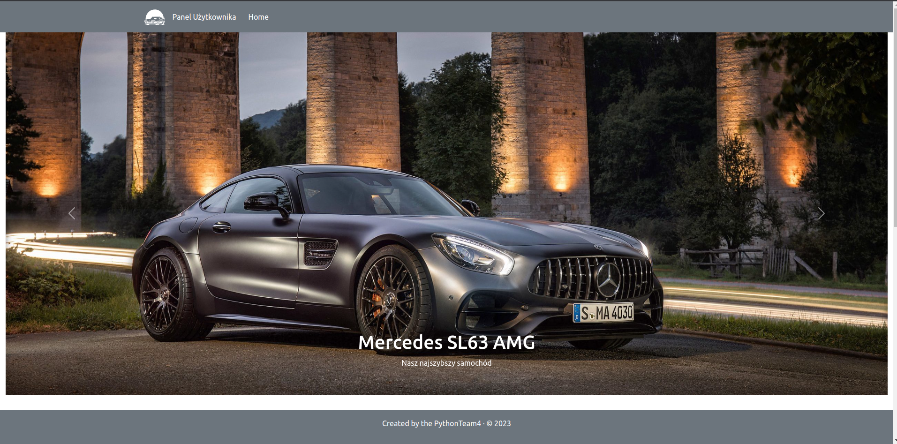
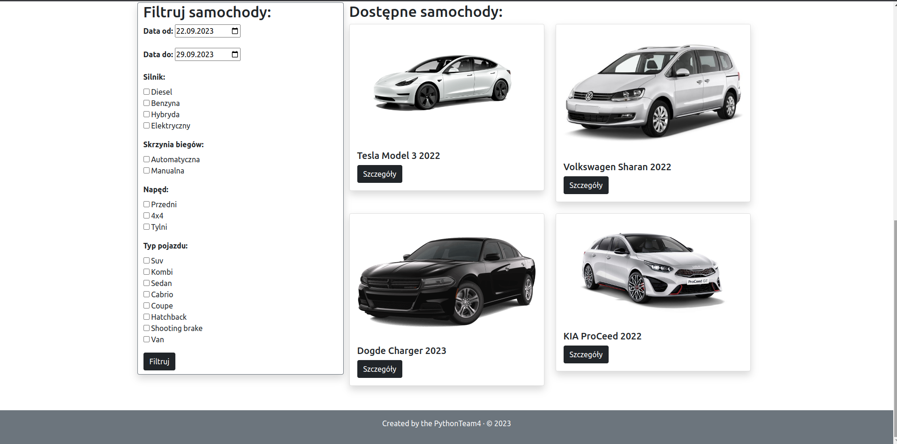
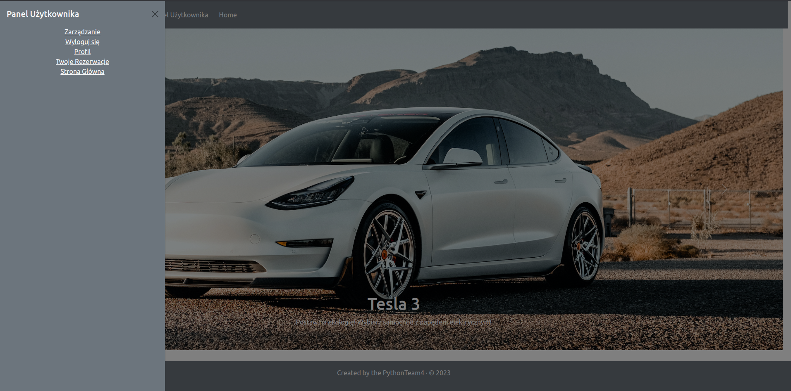
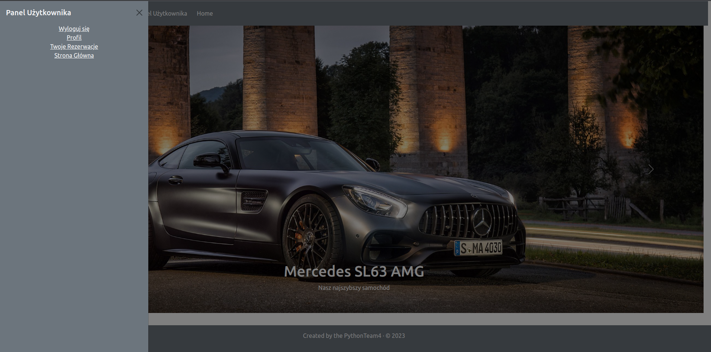
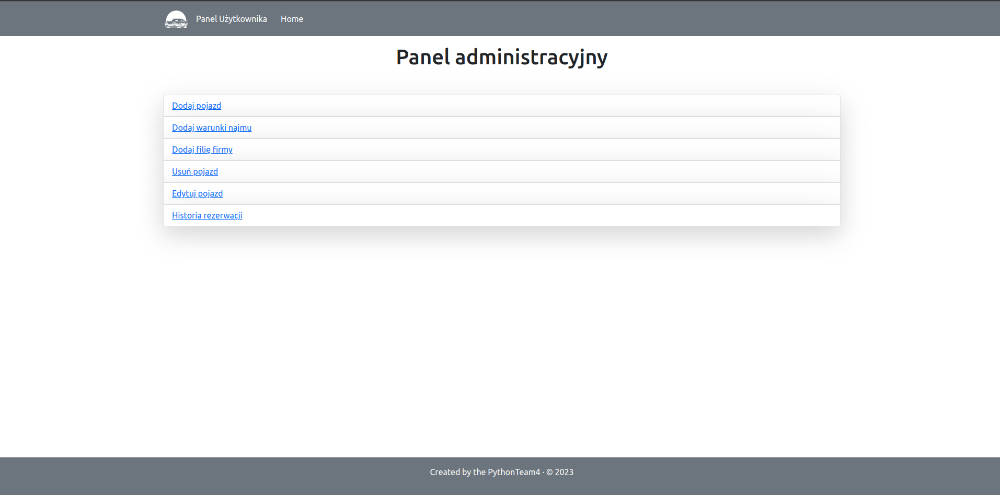
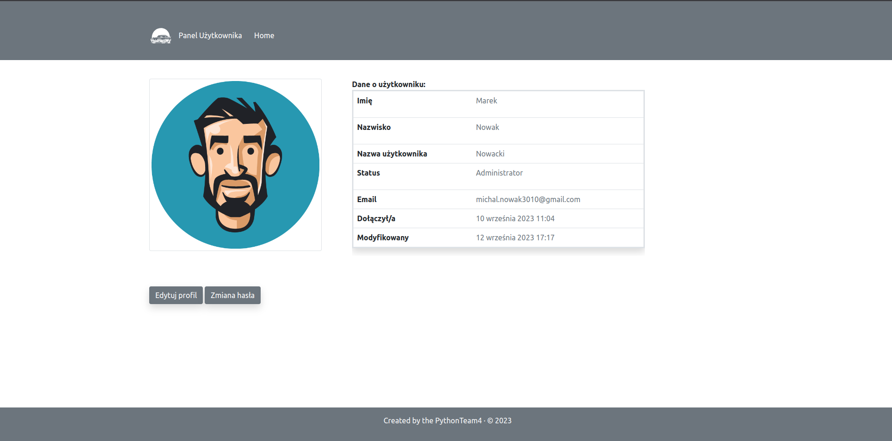
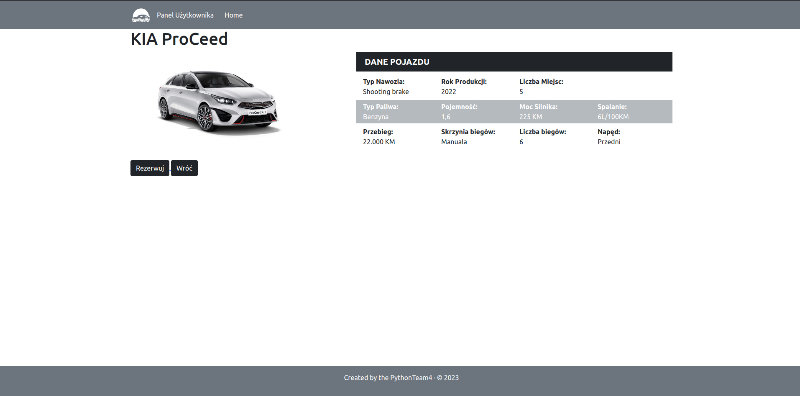
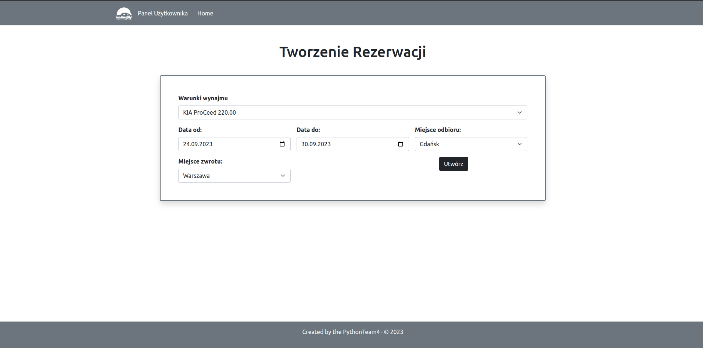
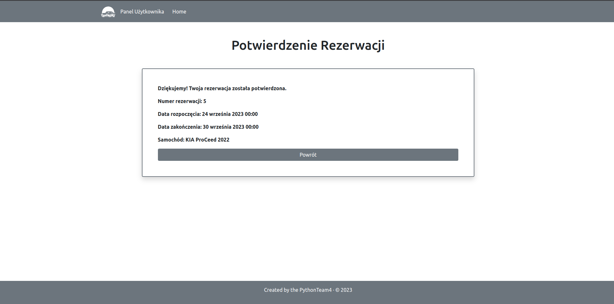
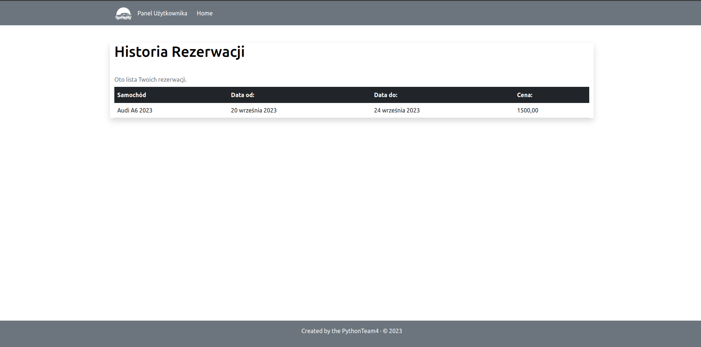

# CarRental – Django Application

CarRental allows you to rent cars

## Features

- User Registration and Login: Users can create accounts and log in to the application.
- Profile: Users can modify their profiles.
- Car View: Detailed car information.
- Rent Applications: Users can rents cars.
- Reservation history: You can view your reservation history.

## Installation

To run CarRental locally, follow these steps:

1. Clone the repository:

```
git clone https://github.com/Nowacki97PL/CarRental.git
```

2. Create a Python virtual environment and activate it:

```
python -m venv venv
```

3. Run virtual environment

Windows:

```
venv/Scripts/activate
```

Linux:

```
source venv/bin/activate
```

4. Install the required dependencies:

```
pip install -r requirements.txt
```

5. Perform database migrations:

```
python manage.py makemigrations
```

```
python manage.py migrate
```

6. Load data to Database

```
python manage.py loaddata dumbdata.json
```

Two user created:

- Nowacki, password 3010Audi

- Lawenda, password 3010Audi

7. Start the development server:

```
python manage.py runserver
```

Access the application in your web browser at http://localhost:8000/

## Configuration

To configure CarRental, create a .env file in the project's root directory and customize it according to
your needs. Here's an example .env file:

```
DEBUG=True
ALLOWED_HOSTS=localhost
SECRET_KEY=my_secret_key
```

## Requirements

The CarRental application has the following dependencies:

- Python,
- Django,
- Other dependencies are listed in the `requirements.txt` file.

## Support and Contact

If you have any questions, feedback, or encounter issues with the CarRental application, please
don't hesitate to contact us at email@example.com.

## TEST

To run the test, cd into the directory where manage.py is:

```
python manage.py test
```

## SCREENSHOT'S













